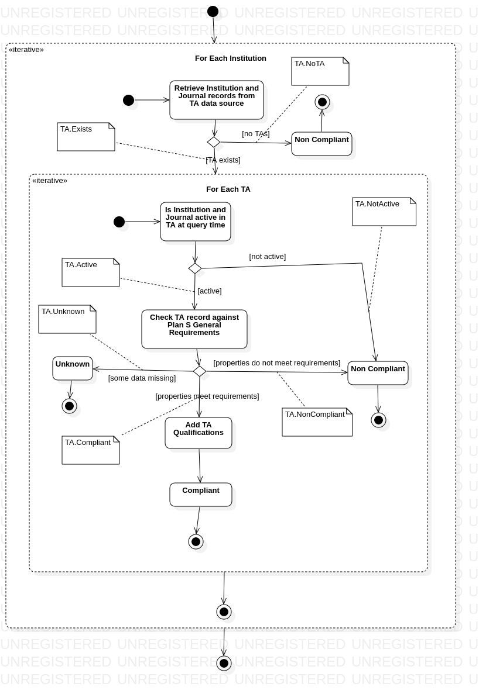

# JCT Algorithm Specification

## Initial Inputs

A request against the compliance algorithm (such as via the Web API) can provide the following constraining parameters:

| Parameter   | Multiplicity | Data type     |
|-------------|--------------|---------------|
| Journal     | 1            | ISSN          |
| Funder      | 0..*         | JCT Funder ID |
| Institution | 0..*         | ROR ID        |

Note that both Funder and Institution are not strictly required for the algorithm to execute.  This is because there are compliance routes documented here which do not *require* either Funder or Institution.  Nonetheless, Funder and Institution data is essential to give the user a complete picture of the compliance space for their context.  The algorithm is specified to allow these partial queries in order to allow us to build predictive or reactive responses to users as they start to assemble their queries via the UI.

## Final Outputs

The output of the algorithm consists of a set of 5 or more compliance analyses for the various input combinations.  Each of these analyses contains:

* The ISSN of the Journal the analysis refers to
* The Crossref IDs of the Funders the analysis refers to
* The ROR IDs of the Institutions the analysis refers to
* The compliance route for which this answer is relevant
* Whether this analysis determines the set of Funder, Institution and Journal here to be compliant.  One of 3 possible outcomes is available:
    * Compliant - the algorithm has determined that the input would comply with Plan S at the time the query was executed
    * Non-Compliant - the algorithm has determined that the input does not comply with Plan S at the time the query was executed
    * Unknown - there was insufficient information in the data source(s) to determine whether the input complies with Plan S or not at the time the query was executed
* Qualifications for compliance - any guidance that the user needs to understand their compliance result in the context of the query.
* An audit trail for the decision - a record of the checks that took place in order to come to this conclusion

There will be no attempt to order the compliance analyses “best first”, as the best route to compliance may be different per user.

Note also that the presence of 5 or more results does not imply that all these results need to be shown to the user.  It will be up to the UI and the API to how to present this information.

## Overall Workflow

The overall workflow begins with a request containing the information described above, and then proceeds as follows (see *Figure 1*):

* Before attempting to run the compliance checks, we filter all JCT Funder IDs for funders that are not Plan S members, as the compliance check is only relevant to those funders.  If, after this process is complete, there are no funders left in the list, then this query is not applicable to Plan S, and an empty result set is returned. 
* Each compliance route is then calculated individually and in parallel: Hybrid, Transformative Journals, Transformative Agreements, Self Archiving, and Full OA.  In advance if each check we ask if the funder’s run configuration requires that route to be calculated (this is contained in the funder database).
  * If the funder configuration indicates that the route does not need to be calculated it can be skipped.
  Each compliance route will output one or more compliance analyses, and these are then collated into the full result set for this run of the algorithm

*Figure 1: Overall workflow*

The following sections expand on the main compliance routes

## Full OA Check

This check determines if the journal is Fully OA.  It can be performed with only knowledge of the Journal.  It proceeds as follows (see *Figure 2*):

* We check to see if the ISSN is in the OA Exceptions list (The Odd Journals).
  * If it appears in the list, record the “caveat” as a qualification (See OA Exception Caveat Qualification below) and then return Compliant immediately
  * If it does not appear on the list, proceed to the next check
* We check to see if the ISSN is in the public DOAJ, and if it is move directly to checking compliance.
* If it does not appear in public DOAJ we check the “in progress” DOAJ dataset for an active application to DOAJ that has not yet been approved or rejected.  If it is not in either data set, then this Journal cannot comply to the Full OA route.
  * If it appears in the “in progress” DOAJ dataset we add a Qualification for the author to be aware of that situation (see Add DOAJ In Progress Qualification below) 
* If we are able to obtain a DOAJ record, then compare the properties of the record with the funder requirements. There are three possible results from this check:
  * Compliant - the record meets the funder’s requirements (see below for details)
  * Non-Compliant - the record does not meet the funder’s requirements (see below for details)
  * Unknown - there is insufficient data in the DOAJ record to determine if it meets the funder’s requirements.
    * If this state is reached, the system should log an alert to review why that was and which data sources can be improved to remove this state.

*Figure 2: Full OA Check*

At the stage “Check DOAJ record against funder requirements”, the following properties of the DOAJ record must be checked against the funder’s specific configuration.

* The publishing licence
* If the record is “in progress” at DOAJ, then the age of the DOAJ record is less than 6 months.

**Add DOAJ In Progress Qualification**
Add a statement to inform the user that their journal is in the “in progress” state at DOAJ.

**OA Exception Caveat Qualification**
Add a statement to inform the user that the journal is exceptional, with a specific caveat taken from the datasource

| Code                     | Associated Properties                                          |
|--------------------------|----------------------------------------------------------------|
| FullOA.Exception         |                                                                |
| FullOA.NoException       |                                                                |
| FullOA.NotInDOAJ         |                                                                |
| FullOA.InProgressDOAJ    |                                                                |
| FullOA.NotInProgressDOAJ |                                                                |
| FullOA.InDOAJ            |                                                                |    
| FullOA.Compliant         | * licence: [licences recorded in DOAJ]                         |
| FullOA.Unknown           | * missing: [List of fields for which data is missing in DOAJ]  |
| FullOA.NonCompliant      | * licence: [licences recorded in DOAJ] * application_age: [age of DOAJ application] if this was a factor in the non-compliant decision |

## Self-Archiving Check

This check determines if the Journal offers a compliant route to Self Archiving.  It can be performed with knowledge of just the Journal, although if Funder information is available this can be used to provide useful qualifications to the result to the user.  It proceeds as follows (see *Figure 3*):

* Start by checking the “negative” RR exceptions datasource.  If the journal is present, we can immediately return a non compliant result, otherwise we continue with the rest of the algorithm
* If the journal is not in the “negative” RR exceptions datasource, then we check the “positive” exceptions datasource.  If it is present in this datasource, then we can immediately return a Compliant result.
* Is the Journal in the OA.Works Permissions Checker?  If not, move directly onto checking the Rights Retention policy for the funder:
* If we are able to obtain an OA.Works record, then compare the properties with the funder requirements.  There are three possible results from this check:
  * Compliant - the record meets the funder requirements
  * Non-Compliant - the record does not meet the funder requirements
  * Unknown - there is insufficient data in the OAB PC record to determine if it meets the funder requirements.
    * If this state is reached, the system should log an alert to review why that was and which data sources can be improved to remove this state.
* If the result of the previous step is “Compliant” then the check can stop here and the result be reported, otherwise continue
* If the result above is “Non-Compliant” or “Unknown”, then we proceed to the next step to check the Rights Retention policy for the funder.
* Rights Retention policy for the funder: we check whether the Funder is currently implementing the Rights Retention policy.  See Check Funder Rights Retention Policy Figure 4 for the details of this check.  There are two possible outcomes:
  * The funder policy starts on or before 1st January 2021, or before the current date, then a policy is active (go to the next step)
  * Otherwise, the policy is not active.  In this case we respond with either “Unknown” or “Non-Compliant, depending on which of those was received from the OAB check above, and processing can stop
    * If the “Unknown” state is reached, the system should log an alert to review why that was and which data sources can be improved to remove this state
* If it is active, add a Qualification for the author to apply a self-archiving statement (see Add Author Advice Qualification below), then return as “Compliant”.

*Figure 3: Self-Archiving Check*

At the point “Check OA.Works PC record against funder requirements”, the following checks against the funder configuration must be made (data for comparison will be in the funder’s configuration from the funder database):
* Version allowed for SA
* Allowed SA Licence
* Embargo

**Add Author Advice Qualification:**
Add a statement to instruct the author to submit text asserting their right to self archive.

**Check Funder Rights Retention Policy:**
For each funder, determine if it has a start date for when they apply the rights retention policy.  If that date is in the past, or if it is on or before 1st January 2021 (irrespective of the date the check is carried out), the rights retention policy is active.  If there is no date, or the date is in the future and after 1st January 2021, the policy is not active.  If there are multiple funders, the check should return active if one or more of them is active.  See *Figure 4*.

*Figure 4: Add Funder Implementation Date Qualification*

During each transition in the above diagram (*Figure 3*), the algorithm should record and be able to report on the following information: 

| Code                 | Associated Properties               |
|----------------------|-------------------------------------|
| SA.RRException       |                                     |
| SA.RRNoException     |                                     |
| SA.NonCompliant      |                                     |
| SA.NotAsserted       |                                     |
| SA.InOAB             |                                     | 
| SA.NotInOAB          |                                     |
| SA.OABCompliant      | * licence *embargo *version |
| SA.OABNonCompliant   | * licence *embargo *version |
| SA.OABIncomplete     | * missing                           |
| SA.FunderRRNotActive |                                     |
| SA.FunderRRActive    |                                     |
| SA.Unknown           |                                     |

## Transformative Agreements Check

This check determines if a journal offers a compliant publishing route by determining if the journal and institution are part of an active Transformative Agreement. In order to run, this section of the algorithm requires a Journal and at least one Institution to be present. It proceeds as described below (see *Figure 5*):

* The algorithm below describes a process that needs to be run once for each institution provided:
* Determine if there is one or more transformative agreements which cover both the journal and the institution.  If there is not, there is no compliant route to publishing here
* If such a TA exists, the following steps need to be run for each TA, and the results collated:
* Determine if the journal and institution were both part of that TA at the time the query is executed.  If not, this publishing route is “Non Compliant”, and processing on this TA for this Institution can stop.
  * Note that for algorithm performance, this step and the above step may be executed together.  Here we separate them to draw attention to the fact that journals and institutions may join and leave TAs part way through.
* Do the terms of the TA meet the general Plan S requirements (funders cannot customise compliance with TAs via the funder database)?  There are three possible results from this check:
  * Compliant - the TA meets the Plan S requirements
  * Non-Compliant - the TA does not meet the Plan S requirements
  * Unknown - there is insufficient data in the TA record to determine if it meets the Plan S requirements.
    * If this state is reached, the system should log an alert to review why that was and which data sources can be improved to remove this state.
* If the result of the previous step is “Non Compliant” or “Unknown” then the check can stop here for this TA for this Institution, otherwise continue
* If the result above is “Compliant”, then add any TA Qualifications (see Add TA Qualifications below)
* Once each TA and Institution has been processed in the above way, the results should be collated into a set of answers and returned to the main algorithm.

*Figure 5: Transformative Agreements Check*

At the stage “Check TA record against Plan S General Requirements” there is a sheet in the associated spreadsheet which defines which fields are necessary for the Compliance Check:
* TA - The values that must be present for Plan S compliance for records that are in Transformative Agreements

**Add TA Qualifications**
If the TA states that the option is only open to corresponding authors, this should be added to the qualifications for the record

During each transition in the above diagram (*Figure 5*), the algorithm should record and be able to report on the following information:

| Code            | Associated Properties |
|-----------------|-----------------------|
| TA.NoTA         |                       |
| TA.Exists       | * ta_id *end_date |
| TA.NotActive    |                       |
| TA.Active       |                       |
| TA.Unknown      |                       |
| TA.NonCompliant |                       |
| TA.Compliant    |                       |

## Transformative Journals Check

This check determines if a Transformative Journal with suitable policies has been registered in our data source.  It requires both the Journal and the Funder to run.  It proceeds as follows (see Figure 6):

* Check if the Journal is in the TJ datasource.  If it is not, it is by default “Non Compliant”.
* If it is present, check to see if the TJ record has a funder-specific exclusion policy for the given Funder
  * If it does not this record is Compliant
  * Otherwise this record is Non Compliant

*Figure 6: Transformative Journals Check*

During each transition in the above diagram (Figure 6), the algorithm should record and be able to report on the following information: 

| Code                  | Associated Properties |
|-----------------------|-----------------------|
| TJ.NoTJ               |                       |
| TJ.Exists             |                       |
| TJ.Compliant          |                       |
| TJ.FunderNonCompliant |                       |

## Hybrid Check

This check determines if a journal is a hybrid.  It proceeds as follows (see *Figure 7*)

* Check if the Journal appears in DOAJ.  If it does, it is not a hybrid, and the route can terminate with a Non-Compliant result
* Check if the Journal appears in the OA.Works Permissions database.
  * If it is not present, we are unable to tell if the journal is a hybrid, and we can terminate with an Unknown result
* Check if the permissions database indicates this is a hybrid
  * If the journal type is present and is not “hybrid” or “transformative” then we return a Non-Compliant result
  * If the journal type is not present, we are unable to tell if this is a hybrid journal, so we return an Unknown result
  * If the journal type is present and is “hybrid” or “transformative” then we continue to the next check
* Check of the Journal’s properties in OA.Works permissions database match the requirements for the funder.
  * If they do not, respond with a Non-Compliant result
  * If there is insufficient information to determine if the properties match, return an Unknown result
  * If the properties match, return a Compliant result

*Figure 7: Hybrid Check*

At the stage “Check properties against funder policies”, the following properties need to be checked:
* Allowed licences for open content

During each transition in the above diagram (Figure 7), the algorithm should record and be able to report on the following information:

| Code                  | Associated Properties |
|-----------------------|-----------------------|
| Hybrid.InDOAJ         |                       |
| Hybrid.NotInDOAJ      |                       |
| Hybrid.NotInOAW       |                       |
| Hybrid.InOAW          |                       |
| Hybrid.NotHybridInOAW |                       |
| Hybrid.OAWTypeUnknown |                       |
| Hybrid.HybridInOAW    |                       |
| Hybrid.NonCompliant   | * licence             |
| Hybrid.Unknown        | * missing             |
| Hybrid.Compliant      | * licence             |
